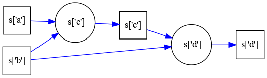

# Xdeps

Value dependency manager with convenient syntax for expressions dependency


```python
s={'a': 1, 'b': 2} # Assume a container exists

import xdeps
m=xdeps.Manager() # Create dependency manager
s_=m.ref(s,'s') # Create a reference to the container

s_['c']= s_['a']+s_['b'] # Now s['c'] depends on s_['a'] and s_['b']
s_._exec('d=c+b') # Same as above using a convenient function to save typing
s_['a']=1.1 # This updates 'a' and anything depending on 'a' such as 'c' and 'd'

assert s['c']==s['a']+s['b']
assert s['d']==s['c']+s['b']

s_['a']+=1.1 # Increment a
assert s['c']==s['a']+s['b']
assert s['d']==s['c']+s['b']

s_['c']+=s_['b']*2 # Modify expression
print(s_['c']._expr) # Inspect c-> ((s['a']+s['b'])+(s['b']*2))

set_ab=m.gen_fun('set_ab',a=s_['a'],b=s_['b']) # generate setter function
set_ab(2.3,1.2) # set a, b and dependecies
assert s['c']==s['a']+s['b']+s['b']*2
assert s['d']==s['c']+s['b']

m.plot_deps(backend='os') # Inspect depency graph
```



## Description

The library is based on a manager `xdeps.Manager()` that manages tasks.


